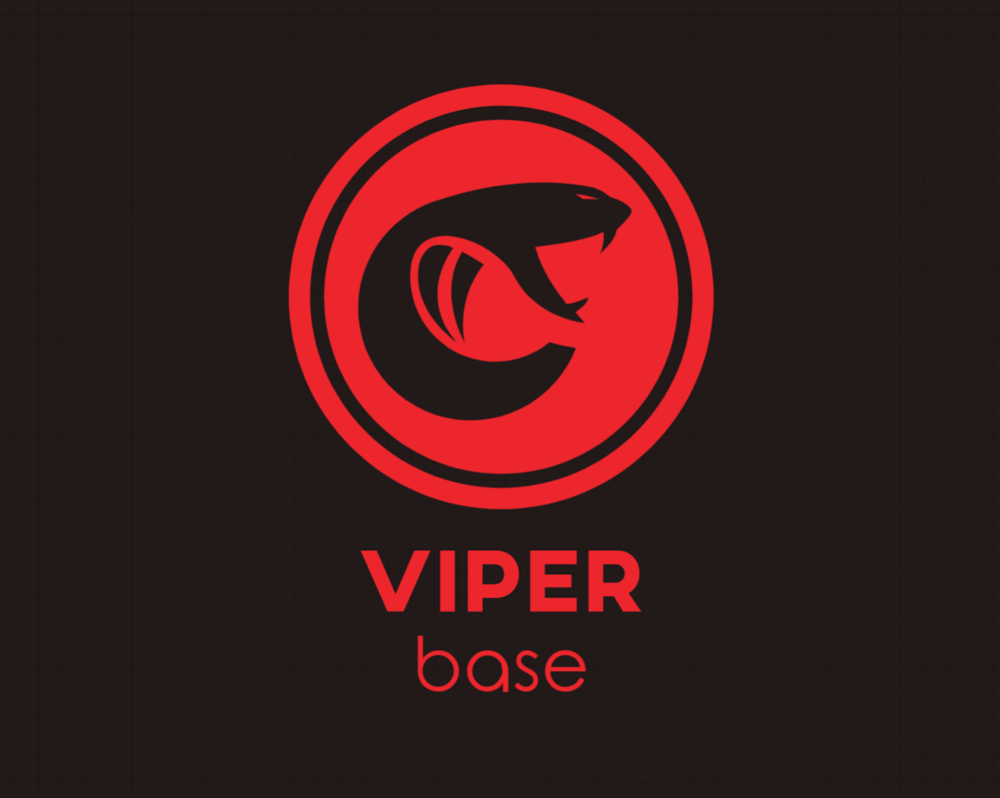

<h1 align="center">Viperbase [WIP]</h1>

    

Simple Firebase alternative, provide rapid support for quickly building internal products or prototypes.Create a backend in less than 2 minutes. Start your project with a Postgres Database, Authentication, instant APIs, and realtime subscriptions.    

## TODO

+ [ ]Architecture design and technology selection
+ [ ]Authentication and authorization
+ [ ]Auto-generated APIs
+ [ ]Realtime subscriptions
+ [ ]Hosted Postgres Database
+ [ ]Dashboard
+ [ ]Storage
+ [ ]Functions

## Vision

[Supabase](https://supabase.io/) plus:

+ All components are built using golang
+ The service program has only one binary executor(eg,auth-service，rest-api-service,realtime-service etc.)
+ Each service can be separately deployed on different servers using the same binary program

## Inspired By

+ [Firebase](https://firebase.google.com/)
+ [Supabase](https://supabase.io/)